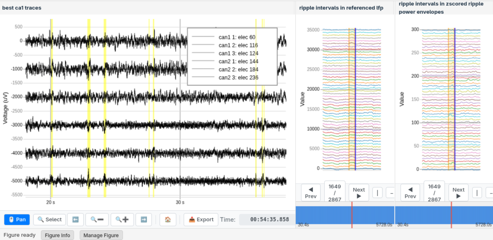
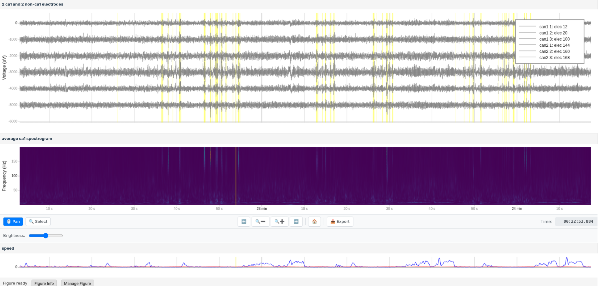

# Figpack - Portable, Interactive Scientific Visualizations

```yaml slide-metadata
slide-type: title
subtitle: Overview and Demonstration for Datajoint, October 2025
author: Jeremy Magland, Center for Computational Mathematics, Flatiron Institute
```

---

# Overview

```yaml section-metadata
font-size: large
```

**Purpose**: Introduce Figpack and attract early adopters and developers.

::: incremental
* Motivation — Why Figpack? - Limitations of existing tools
* How Figpack Works - From code to self-contained HTML apps
* Building a Figure - Create, view, and share visualizations
* Examples and Layouts - Combine multiple views into dashboards
* Domain Extensions - e.g. spike sorting with figpack_spike_sorting
* Performance at Scale - Efficient handling of large, multi-channel data
* Figure Lifecycle - Uploading, sharing, and managing hosted figures
* Extending Figpack - Creating your own custom views
---

```yaml section-metadata
font-size: large
```

# Why Figpack?

The challenge:
::: incremental
* Static plots are great for papers, but limited for exploring complex data.
* Interactive plots often require Jupyter notebooks or servers.
* Sharing rich visualizations is hard — dependencies, data, and formats rarely travel well.
* Large datasets overwhelm most browser-based tools.
:::

The Figpack solution:
::: incremental
* Self-contained: bundles data + visuals into one portable HTML directory.
* Fast & scalable: built on Zarr for chunked, compressed, lazy-loaded data access.
* Flexible: supports many views and layouts — from simple plots to complex dashboards.
* Collaborative: share a link, no setup needed.
* Archivable: easily stored as .tar.gz or integrated into data repositories.
* Extensible: add custom or domain-specific view types.
:::

---

# Creating a Figpack Figure

```bash
# Install figpack
pip install figpack
```

```python
import numpy as np
import figpack.views as fp

view = fp.TimeseriesGraph(y_label="Signal")
t = np.linspace(0, 10, 1000)
y = np.sin(2 * np.pi * t) * np.exp(-t / 3.2)
view.add_line_series(name="sine wave", t=t, y=y, color="blue")
view.show(
    upload=True,
    open_in_browser=True,
    title="Quick Start Example"
)
```

Or to upload to the cloud for sharing:

```python
view.show(
    upload=True,
    title="Quick Start Example"
)
```

Must set the `FIGPACK_API_KEY` environment variable.

* * *

```yaml section-metadata
view-type: execute-view
caption: This is the view that appears in the browser.
font-size: 30
```

```python
# This code gets executed to generate the plot
import numpy as np
import figpack.views as fp

view = fp.TimeseriesGraph(y_label="Signal")
t = np.linspace(0, 10, 1000)
y = np.sin(2 * np.pi * t) * np.exp(-t / 3)
view.add_line_series(
    name="sine wave",
    t=t, y=y,
    color="blue"
)
```

---

# How Figpack Displays A Figure

```yaml section-metadata
font-size: large
```

`show()` creates a figure directory on disk

The directory contains:

* **index.html** – the interactive viewer
* **JavaScript and CSS assets** – the rendering engine
* **data.zarr/** – the serialized figure data

Together, these make a self-contained web app

Starts up a lightweight HTTP server to serve the files

Optionally upload to cloud for sharing

(This presentation is itself a [Figpack figure](https://github.com/magland/figpack-overview-presentation)!)

* * *


---

# Creating a Figure

<iframe src="https://users.flatironinstitute.org/~magland/screencasts/presentations/figpack-presentation/figpack-upload-figure-screencast.webm"></iframe>

---

# Examples: Markdown and Image Views

<iframe src="https://flatironinstitute.github.io/figpack/basic_views_tutorial.html?embed=true#markdown-view"></iframe>

* * *

<iframe src="https://flatironinstitute.github.io/figpack/basic_views_tutorial.html?embed=true#image-view"></iframe>

---

# Examples: TimeseriesGraph

<iframe src="https://flatironinstitute.github.io/figpack/basic_views_tutorial.html?embed=true#simple-timeseriesgraph"></iframe>

* * *

<iframe src="https://flatironinstitute.github.io/figpack/basic_views_tutorial.html?embed=true#multiple-series"></iframe>

---

# Handling Large Data Efficiently

```yaml section-metadata
font-size: large
```

::: incremental
* Data stored in Zarr format — chunked, compressed, and lazily loaded.
* Enables interactive visualization of very large datasets.
* Supports hierarchical downsampling for smooth zooming and navigation.
* Only the visible data range is loaded into the browser.
* Works seamlessly for local or cloud-hosted figures.
:::

* * *

<iframe src="https://flatironinstitute.github.io/figpack/basic_views_tutorial.html?embed=true#uniform-timeseries"></iframe>

---

# Examples: Matplotlib and Plotly Views

<iframe src="https://flatironinstitute.github.io/figpack/basic_views_tutorial.html?embed=true#matplotlib-integration"></iframe>

* * *

<iframe src="https://flatironinstitute.github.io/figpack/basic_views_tutorial.html?embed=true#plotly-integration"></iframe>

---

# Example: DataFrame View

```yaml section-metadata
font-size: large
```

Wrap a Pandas DataFrame for interactive viewing of tabular data.

* * *

<iframe src="https://flatironinstitute.github.io/figpack/basic_views_tutorial.html?embed=true#dataframe-view"></iframe>

---


# Composing Views and Layouts

```yaml slide-metadata
slide-type: tabs-on-right
```

Views are the basic visualization units — e.g. TimeseriesGraph, Image, Markdown.

Layouts arrange and synchronize multiple views into dashboards.

Common layout types:

* **Box** – stack views vertically or horizontally
* **TabLayout** – switch between tabs
* **Splitter** – resizable panels

Views in a layout share state (e.g. time range, selected units).

Layouts can be nested and displayed with a single show() call.

* * *

```yaml section-metadata
tab-label: Box Layout
```

<iframe src="https://flatironinstitute.github.io/figpack/basic_views_tutorial.html?embed=true#box-layout"></iframe>

* * *

```yaml section-metadata
tab-label: Tab Layout
```

<iframe src="https://flatironinstitute.github.io/figpack/basic_views_tutorial.html?embed=true#tablayout"></iframe>

* * *

```yaml section-metadata
tab-label: Splitter Layout
```

<iframe src="https://flatironinstitute.github.io/figpack/basic_views_tutorial.html?embed=true#splitter-layout"></iframe>

* * *

```yaml section-metadata
tab-label: Complex Nested Layout
```

<iframe src="https://flatironinstitute.github.io/figpack/basic_views_tutorial.html?embed=true#complex-nested-layout"></iframe>

---

# Domain-specific Extension: Spike Sorting

```yaml slide-metadata
slide-type: tabs-on-right
```

Figpack has extension packages for domain-specific visualizations.

```bash
pip install figpack_spike_sorting
```

* * *

```yaml section-metadata
tab-label: Units Table
```

<iframe src="https://flatironinstitute.github.io/figpack/spike_sorting_tutorial.html?embed=true#units-table"></iframe>

* * *

```yaml section-metadata
tab-label: Unit Metrics
```

<iframe src="https://flatironinstitute.github.io/figpack/spike_sorting_tutorial.html?embed=true#unit-metrics-graph"></iframe>

* * *

```yaml section-metadata
tab-label: Raster Plot
```

<iframe src="https://flatironinstitute.github.io/figpack/spike_sorting_tutorial.html?embed=true#raster-plot"></iframe>

* * *

```yaml section-metadata
tab-label: Spike Amplitudes
```

<iframe src="https://flatironinstitute.github.io/figpack/spike_sorting_tutorial.html?embed=true#spike-amplitudes"></iframe>

* * *

```yaml section-metadata
tab-label: Average Waveforms
```

<iframe src="https://flatironinstitute.github.io/figpack/spike_sorting_tutorial.html?embed=true#average-waveforms"></iframe>

* * *

```yaml section-metadata
tab-label: Autocorrelograms
```

<iframe src="https://flatironinstitute.github.io/figpack/spike_sorting_tutorial.html?embed=true#autocorrelograms"></iframe>

* * *

```yaml section-metadata
tab-label: Unit Locations
```

<iframe src="https://flatironinstitute.github.io/figpack/spike_sorting_tutorial.html?embed=true#unit-locations"></iframe>

* * *

```yaml section-metadata
tab-label: Cross-Correlograms
```

<iframe src="https://flatironinstitute.github.io/figpack/spike_sorting_tutorial.html?embed=true#cross-correlograms"></iframe>


* * *

```yaml section-metadata
tab-label: Sorting Curation
```

<iframe src="https://flatironinstitute.github.io/figpack/spike_sorting_tutorial.html?embed=true#sorting-curation"></iframe>

---

# Other miscellaneous views

<iframe src="https://flatironinstitute.github.io/figpack/misc_tutorial.html?embed=false"></iframe>

---

# Figpack in the wild

```yaml slide-metadata
slide-type: box-layout-on-right
```

```yaml section-metadata
font-size: large
```

A couple labs are already using Figpack, but I don't have permission to share links to their figures yet.

* * *



* * *



---

# Lifecycle Management of Figures

```yaml slide-metadata
slide-type: box-layout-on-right
```

```yaml section-metadata
font-size: large
```

::: incremental
* By default, uploaded figures expire after 24 hours.
* Users can renew or pin figures to extend their lifetime.
* Users can view and manage their uploaded figures and usage statistics through a web dashboard.
* Admins can monitor overall system usage and manage pinned figures.
* Users can configure their own cloud buckets for figure storage.
:::

* * *


* * *


---

# Creating Custom Views

```yaml section-metadata
font-size: large
```

Figpack is extensible through custom view types.

Steps to create a new view:

::: incremental
* Create a new extension package or add to an existing one.
* In Python, define a new view class inheriting from `figpack.FigpackView`.
* On the frontend, implement rendering logic using JavaScript/TypeScript.
:::

AI Coding Companion can help generate boilerplate code - give it access to the docs!

* * *

<iframe src="https://flatironinstitute.github.io/figpack/developer_guide/creating_a_new_view.html?embed=true"></iframe>

---

# Summary

```yaml section-metadata
font-size: large
```

In a nutshell:
* Figpack turns scientific data into shareable, self-contained HTML apps for interactive exploration.
* Fast, scalable, and extensible — powered by Zarr
* Works with timeseries, images, plots, and dashboards
* Easily shared, archived, and extended
* Enables open, reproducible, and interactive science